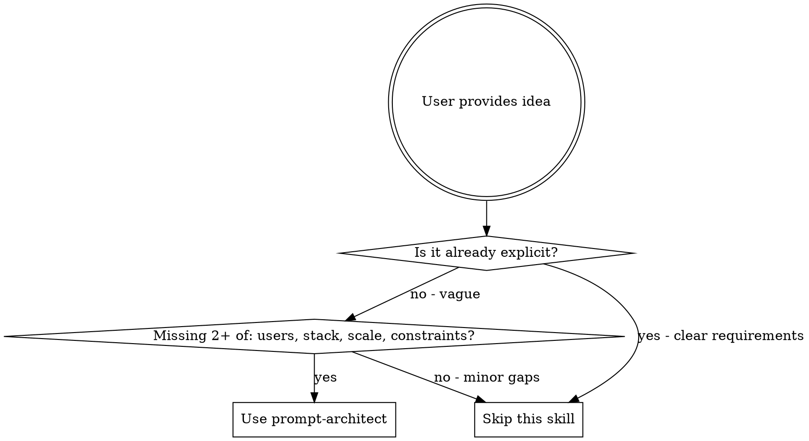

# Prompt Architect

Transform rough application ideas into explicit, buildable prompts for Claude Code.

## Overview

**Core principle:** Vague prompts produce vague results. This skill extracts hidden assumptions, surfaces missing requirements, and generates structured prompts that Claude Code can execute without guesswork.

## When to Use



**Use when:**
- User says "build X" without specifying how, for whom, or where
- Requirements are implicit or assumed
- Scope is unclear (MVP vs full product)
- Tech decisions are unspecified
- "Make it like [product]" without explicit features

**Skip when:**
- User provides detailed requirements document
- Explicit tech stack, features, and constraints given
- Simple bug fix or small feature addition
- User explicitly wants to figure it out as they go

## Process

### Step 1: Parse the Raw Idea

Extract from user input:
- **Core concept**: What are they building?
- **Explicit constraints**: Anything already specified?
- **Implied scope**: Single script or production system?

### Step 2: Score Complexity (1-5)

| Dimension | 1 (Simple) | 3 (Medium) | 5 (Complex) |
|-----------|------------|------------|-------------|
| Features | Single purpose | 3-4 features | 5+ interconnected |
| Integrations | Standalone | 1-2 services | Multiple APIs |
| Data | No persistence | Simple storage | Complex schema |
| Users | Single/CLI | Basic multi-user | Roles, real-time |
| Deployment | Local script | Single service | Distributed |

**Overall** = average of applicable dimensions.

### Step 3: Identify Gaps

Check for missing critical info:

- [ ] **Target users** - Who uses this?
- [ ] **Tech stack** - Language, framework preferences?
- [ ] **Scale** - Expected load, data volume?
- [ ] **Environment** - Local, cloud, edge, browser?
- [ ] **Integrations** - What must it connect to?
- [ ] **Constraints** - Budget, timeline, existing code?

### Step 4: Clarify (if needed)

If **more than 2 gaps** affect architecture:
- Ask up to 3 focused questions
- Use multiple choice when possible
- Skip if sensible defaults exist

### Step 5: Generate Structured Prompt

Select template by complexity score:

---

## Output Templates

### Simple (Score 1-2)

```markdown
## Task
[One clear sentence]

## Requirements
- [Explicit requirement 1]
- [Explicit requirement 2]

## Constraints
- [Technical constraint]
- [Environmental constraint]

## Success Criteria
- [Measurable outcome 1]
- [Measurable outcome 2]
```

### Medium (Score 3-4)

```markdown
## Context
[Problem, why it matters, who benefits - 2-3 sentences]

## Requirements

### Functional
- [What system must do]
- [Key user interactions]

### Non-Functional
- [Performance]
- [Security]
- [UX/DX]

## Architecture

### Components
- **[Component]**: [Responsibility]

### Data Flow
[Inputs -> Processing -> Outputs]

## Tech Decisions
- **[Category]**: [Choice] - [Rationale]

## Implementation Order
1. [Foundation]
2. [Next step]
3. [Continue...]

## Edge Cases
- [What could break] -> [How to handle]
```

### Complex (Score 5)

```markdown
## Context
[Problem, business value, users, success metrics]

## Requirements

### Functional
[Numbered list with acceptance criteria]

### Non-Functional
- **Performance**: [Latency, throughput targets]
- **Scalability**: [Growth expectations]
- **Security**: [Auth, compliance]
- **Reliability**: [Uptime, failure handling]

## System Architecture

### Components
[Each with responsibility]

### Interactions
[Sync/async, protocols, contracts]

### Data Architecture
- **Storage**: [Choices, rationale]
- **Schema**: [Key entities]
- **Flow**: [Transforms, persistence]

### API Contracts
[Key endpoints with shapes]

## Tech Stack
| Layer | Choice | Rationale |
|-------|--------|-----------|

## Implementation Phases

### Phase 1: Foundation
- [Core infrastructure]
- **Milestone**: [What works]

### Phase 2: Core Features
- [Primary features]
- **Milestone**: [What works]

### Phase 3: Polish
- [Optimization, additional features]
- **Milestone**: [Production ready]

## Testing Strategy
- **Unit**: [What to test]
- **Integration**: [Key points]
- **E2E**: [Critical journeys]

## Risks
| Risk | Impact | Mitigation |
|------|--------|------------|

## Open Questions
[Decisions needing input]
```

---

## Output Principles

1. **Explicit over implicit** - Surface hidden assumptions
2. **Decisions over options** - Make recommendations; user can override
3. **Actionable over abstract** - Output should be executable
4. **Surface non-obvious** - Security, edge cases, scale issues
5. **Right-sized** - Match detail to complexity

---

## Common Mistakes

| Mistake | Fix |
|---------|-----|
| Accepting "build X" without clarification | Always identify gaps first |
| Over-engineering simple ideas | Match template to complexity score |
| Leaving tech decisions open | Make opinionated recommendations |
| Ignoring non-functional requirements | Always include performance, security, errors |
| Generating abstract architecture | Every component needs concrete responsibility |
| Skipping edge cases | Explicitly list failure modes |

---

## Example

### Input
```
/prompt-architect "slack bot that queries our postgres database"
```

### Gap Analysis
- Users? (Non-technical team querying data)
- Stack? (Node.js good for Slack SDK)
- Security? (Read-only, SQL injection prevention)
- Scale? (Bursty, Lambda-friendly)

### Output (Medium - Score 3)

```markdown
## Context
Slack bot enabling non-technical team to query business data via natural language,
reducing dependency on engineers for ad-hoc reports.

## Requirements

### Functional
- NL query via slash command or mention
- LLM translates to SQL
- Execute on read-only Postgres replica
- Formatted results in Slack (tables, simple charts)
- Query history per user

### Non-Functional
- Response < 5s for typical queries
- SQL injection prevention (parameterized, validated)
- Rate limiting per user
- Audit logging all queries

## Architecture

### Components
- **Slack App**: Receives commands, sends responses
- **Query Service**: NL->SQL, validation, execution
- **Postgres Replica**: Read-only query target

### Data Flow
User -> Slack API -> Query Service -> LLM -> Validation -> Postgres -> Format -> Slack

## Tech Decisions
- **Runtime**: Node.js - Good Slack SDK
- **LLM**: Claude API - Strong SQL generation
- **Hosting**: AWS Lambda - Cost-effective for bursty traffic

## Implementation Order
1. Slack app with slash command handler
2. LLM integration for SQL generation
3. Postgres read-only connection
4. Result formatting
5. Validation layer
6. Rate limiting + audit logging

## Edge Cases
- Invalid SQL -> Reject with explanation
- Query timeout -> Cancel + notify
- Large results -> Paginate or summarize
- Slack API failure -> Retry with backoff
```
